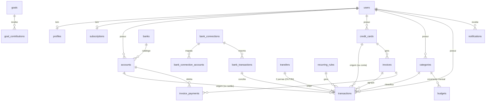

# Banco de dados — modelo e decisões

Fonte de verdade da estrutura: [`packages/database/prisma/schema.prisma`](../packages/database/prisma/schema.prisma).
O que o Prisma não expressa (CHECKs, RLS, triggers, FKs deferidas) está em
[`20261004000100_constraints_and_rls/migration.sql`](../packages/database/prisma/migrations/20261004000100_constraints_and_rls/migration.sql).

## 1. Visão geral

25 tabelas, PostgreSQL. Todas as tabelas de dados do usuário têm `user_id`.



Tabelas auxiliares: `consents`, `privacy_requests` (LGPD), `push_tokens`, `idempotency_keys`
(fila offline), `webhook_events` (idempotência de webhooks), `audit_logs`.

## 2. Convenções

| Tema | Regra |
|---|---|
| **Dinheiro** | Sempre centavos em `BIGINT` (`*_cents`). Nunca `float`/`numeric` fracionário. A API serializa como número inteiro. |
| **Datas de calendário** | `DATE` sem fuso (`occurred_on`, `due_date`, `month`). Instantes são `timestamptz`. "Hoje" é calculado no fuso do perfil do usuário. |
| **IDs** | `UUID` com `gen_random_uuid()`. O app mobile pode gerar o UUID (criação offline idempotente). `users.id` = id do Supabase Auth. |
| **Soft delete** | `deleted_at` em contas, cartões, categorias, lançamentos, transferências, regras e metas (histórico depende deles). Orçamentos, aportes e dados de infraestrutura são apagados de verdade. |
| **Timestamps** | `created_at`/`updated_at` em tudo que muda. `updated_at` também é mantido por trigger (UPDATEs fora do Prisma). |
| **Concorrência** | `transactions.version` (bloqueio otimista) + índice `(user_id, updated_at)` para sync incremental. |

## 3. Regras de negócio refletidas no modelo

**Saldo da conta não é coluna.** É calculado:

```
saldo = opening_balance
      + Σ INCOME                       (lançamentos da conta, não excluídos, POSTED)
      − Σ EXPENSE
      + Σ TRANSFER com side = IN
      − Σ TRANSFER com side = OUT
      − Σ invoice_payments da conta
```

Guardar o saldo em coluna cria divergência. Se o cálculo ficar lento, adicionamos cache (view
materializada ou coluna mantida por trigger) medindo antes.

**Origem do lançamento: conta XOR cartão.** `CHECK`: exatamente um entre `account_id` e `card_id`.
`card_id` ⇔ `payment_method = CREDIT`. Compras no cartão **não** mexem no saldo da conta até a
fatura ser paga.

**Fatura e parcelas.**
- `invoices` é criada sob demanda (uma por cartão/mês, `UNIQUE(card_id, reference_month)`).
  A fatura de uma compra é definida pela data da compra e pelo `closing_day`.
- Compra parcelada = N linhas em `transactions` com o mesmo `installment_group_id`. `occurred_on`
  de cada parcela é a data em que ela é cobrada (compra + i meses), então o orçamento do mês
  reflete a parcela daquele mês.
- Total da fatura = soma dos lançamentos com `invoice_id` (calculado).
- **Pagar a fatura** = `invoice_payments` (debita a conta, **não** conta como despesa — a despesa já
  foi contada na compra). Evita dupla contagem.
- Limite disponível = `limit_cents` − faturas em aberto − parcelas futuras (calculado na API).

**Transferências.** `transfers` é o cabeçalho; os efeitos vêm de duas linhas em `transactions`
(`type = TRANSFER`, `transfer_side` OUT e IN, `UNIQUE(transfer_id, transfer_side)`). Assim saldo,
listagem e filtros por conta usam uma única tabela. Transferências ficam fora de receitas/despesas.

**Recorrência.** `recurring_rules` guarda o modelo; o job gera as ocorrências a partir de
`next_run_on`. `UNIQUE(recurrence_id, occurred_on)` torna a geração idempotente e impede regerar
uma ocorrência que o usuário excluiu.

**Orçamento e metas.** Orçamento: uma linha por (categoria, mês); "copiar do mês anterior" é uma
operação da API. Meta: valor atual = `initial_cents` + Σ `goal_contributions` (aportes positivos,
resgates negativos).

**Categorias.** As padrão são **copiadas** para cada usuário no cadastro (`seedDefaultCategories`),
marcadas por `system_key`. O usuário edita/exclui livremente; `UNIQUE(user_id, system_key)` evita
duplicar. Compatibilidade `categories.type` × `transactions.type` é validada na API.

## 4. Isolamento por usuário (defesa em camadas)

1. **API:** toda consulta filtra por `user_id` do JWT; testes de IDOR no CI.
2. **FKs compostas `(user_id, id)`:** o banco impede um lançamento do usuário A apontar para a conta,
   categoria ou cartão do usuário B, mesmo com bug na API. (Testado em `test/schema.test.ts`.)
3. **Row Level Security:** habilitado em **todas** as tabelas. Requisições de usuário rodam como o
   papel `app_user` (não ignora RLS) com `app.user_id` fixado:

   ```ts
   import { withUser } from "@app/database";
   await withUser(prisma, userId, (tx) => tx.transaction.findMany({ ... }));
   ```

   Sem `app.user_id` nenhuma linha é visível (falha fechada). `anon`/`authenticated` do Supabase não
   têm acesso a nada (a Data API/PostgREST fica efetivamente desligada para estas tabelas).
   `audit_logs` e `webhook_events` não são acessíveis a `app_user`.
   A migration **falha** se alguma tabela ficar sem RLS ou, tendo `user_id`, sem policy.

**Jobs e rotinas administrativas** usam o cliente direto (papel dono, ignora RLS) e **devem** filtrar
por `user_id` explicitamente.

**Configuração de papéis (Supabase).** A migration cria `app_user` (NOLOGIN) e o associa ao usuário que
a executa. Se a API conectar com outro papel de login, conceda o acesso:

```sql
GRANT app_user TO <papel_de_login_da_api>;
```

## 5. Open Finance (módulo trocável)

- **Nenhuma coluna guarda credencial, senha ou token bancário.** A autenticação ocorre no fluxo
  oficial do provedor/banco; guardamos só `provider_item_id`, status e datas.
- `bank_connections.provider` é enum — trocar/adicionar provedor = novo valor + novo adapter, sem
  mexer no restante do modelo.
- `bank_transactions` fica separada de `transactions`: permite revisar/conciliar antes de virar
  lançamento. Upsert idempotente por `(connection_id, provider_tx_id)`.
- `consent_expires_at` é opcional: o limite de 12 meses de consentimento foi removido pelo BCB;
  confirmar o comportamento vigente com o provedor.
- Mensagens de erro de sincronização guardam só **código** (`last_error_code`), nunca texto com dados.

## 6. LGPD — como o modelo suporta

| Requisito | Como |
|---|---|
| Exclusão de conta | `DELETE FROM users WHERE id = ?` apaga tudo por cascata de `user_id` (FKs compostas deferidas até o commit, então a ordem não importa). Teste cobre todas as tabelas com `user_id`. |
| Prova do atendimento | `privacy_requests.user_id` vira `NULL` (sem dado pessoal); `audit_logs` não tem FK. |
| Exportação | `privacy_requests` (tipo EXPORT) + arquivo em storage privado com `export_expires_at`. |
| Consentimento | `consents` com tipo, versão do documento, data e revogação; IP só como hash. |
| Minimização | Sem payload bruto do banco; sem credenciais; logs sem dados sensíveis. |

**Retenção — proposta inicial (validar com assessoria jurídica antes do lançamento):**

| Dado | Retenção |
|---|---|
| Dados financeiros e de perfil | Enquanto a conta existir; exclusão efetiva até 15 dias após o pedido |
| Backups do banco | Até 7 dias no plano Pro do Supabase (dado excluído persiste nos backups nesse prazo — informar na política de privacidade) |
| `audit_logs` | 6 meses (referência: art. 15 do Marco Civil da Internet; confirmar enquadramento) |
| `webhook_events` | 30 dias |
| `idempotency_keys` | 48 horas |
| Arquivos de exportação | 7 dias |

Em aberto: por quanto tempo manter o **registro de consentimento** após a exclusão da conta (hoje
`consents` é apagado junto com o usuário).

## 7. Fluxo de migrations

```
20261004000000_init                              ← estrutura, GERADA do schema.prisma
20261004000100_constraints_and_rls               ← SQL manual (CHECK, triggers, RLS, papéis)
20261004000200_open_finance_accounts             ← Open Finance: contas e importação automática
20261004000300_open_finance_investments_cards    ← Open Finance: investimentos e dados de cartão
20261005000100_profile_appearance                ← profiles.appearance (tema da conta, jsonb ≤ 512 bytes)
20261005000200_function_search_path              ← search_path = '' em app_current_user_id() e set_updated_at()
```

Ambiente que já existe (Supabase): depois de atualizar o código, rode `pnpm db:deploy` da sua máquina para aplicar as duas últimas.

1. Primeira vez (sem banco necessário): `pnpm --filter @app/database migrate:init`
2. Aplicar: `pnpm db:deploy` (produção) ou `pnpm db:migrate` (desenvolvimento).
3. Mudança de estrutura: edite `schema.prisma` → `pnpm db:migrate`. Se a mudança criar tabela com
   `user_id`, **a migration manual correspondente deve** habilitar RLS, criar a policy e conceder
   privilégios (a auto-verificação da migration e o teste "toda tabela com user_id tem RLS"
   falham caso contrário).
4. Nunca edite uma migration já aplicada em produção.

## 8. Ajustes em relação ao esboço aprovado

Refinamentos feitos ao detalhar o modelo (registrados para transparência):

- Lançamento tem **conta XOR cartão** (antes: conta sempre) — compra no cartão não pertence a uma conta.
- Nova tabela `invoice_payments` (pagamento de fatura sem dupla contagem).
- Transferência com **pernas** em `transactions` + `transfer_side` (antes: `from_tx_id/to_tx_id` no cabeçalho).
- Nova tabela `bank_connection_accounts` (mapeia conta/cartão do provedor ↔ local).
- `transactions.status` (PENDING/POSTED) para contas a vencer/agendadas.
- Orçamentos sem soft delete; sem índices parciais (evita dependência de recurso preview do Prisma).
